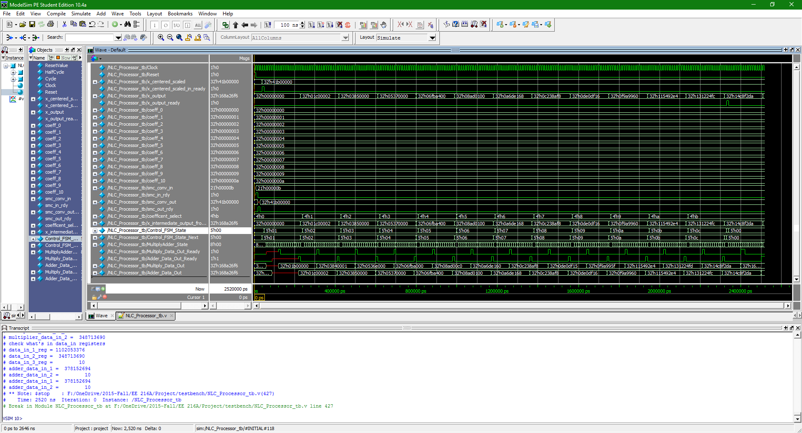

verilogADCcorrection
======
A Verilog design for an ADC Non-linearity Correction Engine

#### Screenshot

## Getting Started

### Installation

## Contributors

### Contributors on GitHub
* [Anthony Nguyen](https://github.com/resolutedreamer)
* [Carlos Ochoa]

### Third party libraries

## License 
* This project is unlicensed 

## Version 
* Version 1.0

## Contact
#### Anthony Nguyen
* Homepage: www.resolutedreamer.com

Last Updated 2015/12/04